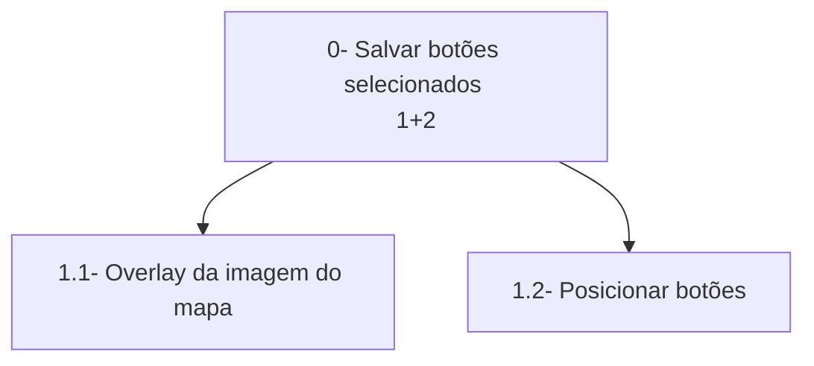

# Análise de Tarefas

> **_NOTE:_**: A equipe deve descrever as funcionalidades mais importantes da interface/produto. A equipe deve modelar pelo menos 1 HTA, 1 GOMS e 1 CTT (de pelo menos 4 funcionalidades diferentes). Cada diagrama deve ter um texto explicando a funcionalidade.

## Funcionalidades
1. Botões para inserir paredes  
2. Criação do mapa com as paredes selecionadas  
3. --Acessibilidade--
4. --?--

## HTA
### a

### b
### c
### d

## GOMS
### a
### b
### c
### d

## CTT
### a
### b
### c
### d
