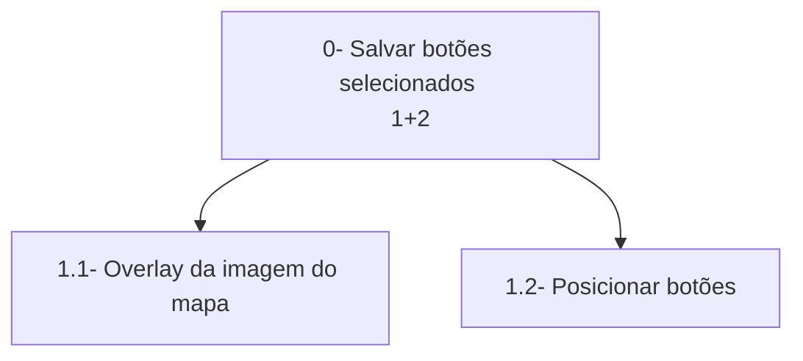
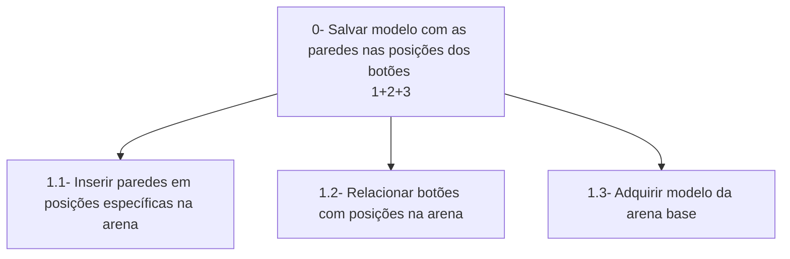

# Análise de Tarefas

> **_NOTE:_**: A equipe deve descrever as funcionalidades mais importantes da interface/produto. A equipe deve modelar pelo menos 1 HTA, 1 GOMS e 1 CTT (de pelo menos 4 funcionalidades diferentes). Cada diagrama deve ter um texto explicando a funcionalidade.

## Funcionalidades
1. Botões para inserir paredes  
2. Criação do mapa com as paredes selecionadas  
3. Importar arena
4. Aplicar zoom

## HTA
### 1 - Botões para inserir paredes
A parte visual terá botões, igual às possíveis paredes na arena, junto de uma imagem em overlay, para deixar mais fácil a visualização de como a arena final seria.  

### 2 - Criação do mapa com as paredes selecionadas
Levando em conta os botões selecionados na parte visual, será criada paredes nas posições correspondentes na arena.  

### 3 - Importar arena
### 4 - Aplicar zoom

## GOMS
### 1 - Botões para inserir paredes
Se pode criar uma arena customizada utilizando cliques, selecionando as paredes que serão colocadas, facilitando a criação e também uma "pré-visualização" da nova arena.  
- GOAL 0: Criar uma arena customizada, baseada em uma arena base.     
    - GOAL 1: Adicionar/Remover ou editar paredes extras.    
        - METHOD 2.A: Clicar nos botões onde se deseja adicionar/remover paredes.  
          (SELECTION RULE: Caso a parede esteja longe/preferência)  
        - METHOD 2.B: Selecionar as paredes utilizando setas e Enter  
          (SELECTION RULE: Caso a parede estja perto/preferência)  
          - METHOD 2.B.1: Movimentar entre as paredes usando as setas do teclado  
          - METHOD 2.B.2: Adicionar/Remover parede selecionada utilizando a tecla Enter  
    - GOAL 3: Salvar arena customizada.  
        - METHOD 3.A: Clicar no botão de salvar.  
          (SELECTION RULE: Preferência)    
        - METHOD 3.B: Usar atalho Control+S.  
          (SELECTION RULE: Comando rápido)  
      

        
### 2 - Criação do mapa com as paredes selecionadas  
Obter o arquivo do mapa customizado, utilizando a interface de seleção de paredes.  
- GOAL 0: Obter o mapa gerado, baseado nos botões pressionados e da arena base.  
  - METHOD 0.A: Criar um mapa baseado nas paredes salvas.  
    (SELECTION RULE: Preferência)   
      - METHOD 0.A.1: Abrir a interface de seleção de paredes.  
      - METHOD 0.A.2: Selecionar paredes até estar satisfeito.  
      - METHOD 0.A.3: Salvar as paredes selecionadas.  
      - METHOD 0.A.4: Clicar em Criar Mapa.  
    
### 3 - Importar arena
### 4 - Aplicar zoom
- **Goal 0**: Aplicar Zoom em textos ou na própria arena.
  - **METHOD 0.A**: Utilizar a roda do mouse.
  - **METHOD 0.B**: Utilizar o ícone presente na interface.

## CTT
### 1 - Botões para inserir paredes
Para Criar uma arena customizada, o usuário precisa primeiro decidir as paredes que devem ser inseridas, selecioná-las e depois clicar em salvar.  
ABS - Criar arena customizada -> (USR - Decidir que paredes devem ser inseridas >> ABS - Clicar nos botões aonde deseja que as paredes estejam ->(USR-SYS - Clicar em um botão []>> SYS - Mudar a opacidade do botão selecionado) >> USR-SYS - Clicar em salvar []>> SYS - Salvar os botões selecionados)      

### 2 - Criação do mapa com as paredes selecionadas
Para utilizar uma arena customizada, o usuário precisa criar a arena, e depois a carregar    
ABS - Utilizar arena customizada -> (ABS - Criar arena customizada []>> USR-SYS - Pressionar o botão de Criar Mapa []>> SYS - Criar mapa baseado nas paredes selecionadas []>> USR-SYS - Carregar mapa em um simulador) 

### 3 - Importar arena
### 4 - Aplicar zoom
