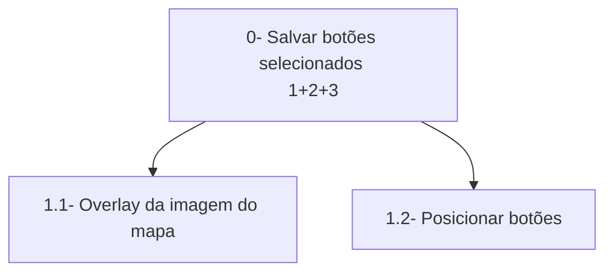
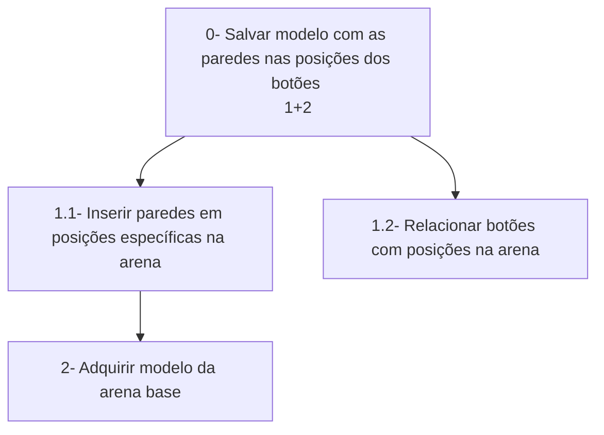

# Análise de Tarefas

> **_NOTE:_**: A equipe deve descrever as funcionalidades mais importantes da interface/produto. A equipe deve modelar pelo menos 1 HTA, 1 GOMS e 1 CTT (de pelo menos 4 funcionalidades diferentes). Cada diagrama deve ter um texto explicando a funcionalidade.

## Funcionalidades
1. Botões para inserir paredes  
2. Criação do mapa com as paredes selecionadas  
3. --Acessibilidade--
4. --?--

## HTA
### a
A parte visual terá botões, igual às possíveis paredes na arena, junto de uma imagem em overlay, para deixar mais fácil a visualização de como a arena final seria.  

### b  
Levando em conta as os botões selecionados na parte visual, será criada paredes nas posições correspondentes na arena.  

### c
### d

## GOMS (Fazer KLM?)
### a
GOAL 0: Criar interface para seleção de botões, a fim de customizar uma arena base
### b
### c
### d

## CTT
### a
### b
### c
### d
