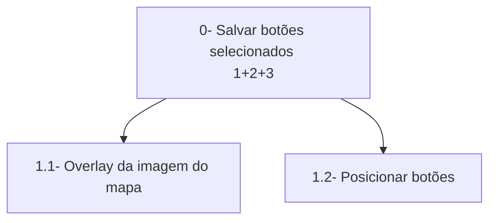
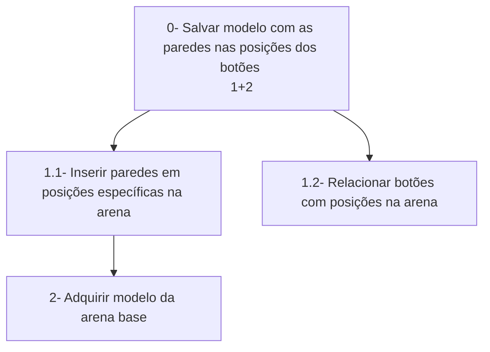

# Análise de Tarefas

> **_NOTE:_**: A equipe deve descrever as funcionalidades mais importantes da interface/produto. A equipe deve modelar pelo menos 1 HTA, 1 GOMS e 1 CTT (de pelo menos 4 funcionalidades diferentes). Cada diagrama deve ter um texto explicando a funcionalidade.

## Funcionalidades
1. Botões para inserir paredes  
2. Criação do mapa com as paredes selecionadas  
3. --Acessibilidade--
4. --?--

## HTA
### 1 - Botões para inserir paredes
A parte visual terá botões, igual às possíveis paredes na arena, junto de uma imagem em overlay, para deixar mais fácil a visualização de como a arena final seria.  

### 2 - Criação do mapa com as paredes selecionadas
Levando em conta os botões selecionados na parte visual, será criada paredes nas posições correspondentes na arena.  

### 3 -
### 4 -

## GOMS (Fazer KLM?)
### 1 - Botões para inserir paredes
- GOAL 0: Criar uma arena customizada, baseada em uma arena base.    
    - GOAL 1: Saber a aparência final da arena.   
        - METHOD 1.A: Visualizar a interface.  
    - GOAL 2: Adicionar/Remover paredes extras.  
        - METHOD 2.A: Clicar nos botões onde se deseja adicionar/remover paredes.
    - GOAL 3: Salvar arena customizada.
        - METHOD 3.A: Clicar no botão de salvar.  
      

        
### 2 - Criação do mapa com as paredes selecionadas
### c
### d

## CTT
### 1 - Botões para inserir paredes
ABS - Criar arena customizada -> (USR - Decidir que paredes devem ser inseridas >> USR-SYS Clicar nos botões aonde deseja que as paredes estejam >> USR-SYS Clicar em salvar []>> Salvar os botões selecionados)  
### 2 - Criação do mapa com as paredes selecionadas
### c
### d
